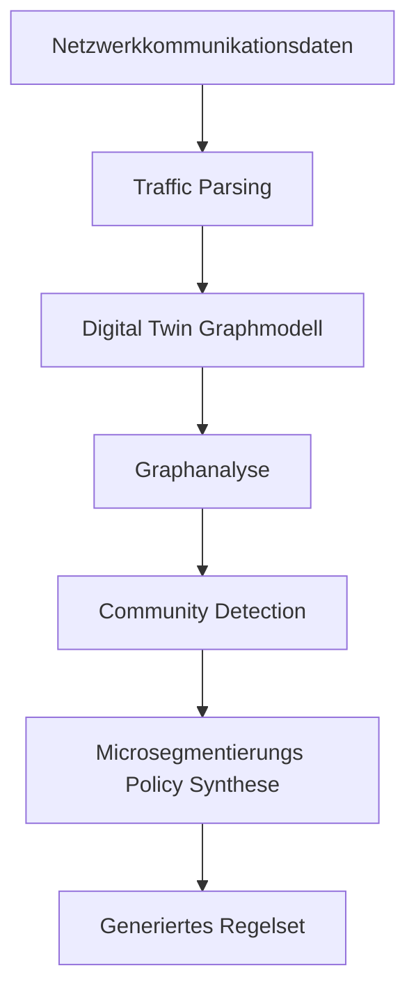
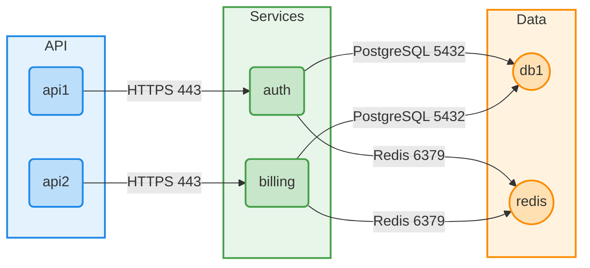

# Feature Set Definition v1

Diese Arbeit konkurrenziert nicht mit bestehenden Tools am Markt, sondern baut einen algorithmisches Forschungsprototypen.

## Table of Contents

- [Feature Set Definition](#feature-set-definition)
- [Zweck dieses Dokuments](#zweck-dieses-dokuments)
- [2. Systemübersicht](#2-systemübersicht)
- [3. Kernfeatures](#3-kernfeatures)
    - [3.1 Import von Netzwerkdaten](#31-import-von-netzwerkdaten)
    - [3.2 Digital Twin Netzwerkmodell](#32-digital-twin-netzwerkmodell)
    - [3.3 Kommunikationsanalyse im Graph](#33-kommunikationsanalyse-im-graph)
    - [3.4 Automatisische Community Detection](#34-automatisische-community-detection)
    - [3.5 Policy-Synthese Engine](#35-policy-synthese-engine)
    - [3.6 Evaluation der Plicies](#36-evaluation-der-plicies)
    - [3.7 Graphenvisualisierung](#37-graphenvisualisierung)

- [4. Optionale / Erweiterungsfeatures](#4-optionale--erweiterungsfeatures)
- [5. Out-of-Scope Features](#5-out-of-scope-features)
- [6. Zusammenfassung](#6-zusammenfassung)

## Zweck dieses Dokuments

Dieses Dokument definiert das geplante Feature Set des Prototyps, der im Rahmen der Bachelorarbeit "Automatisierte Microsegmentierungsstrategie basierend auf Digital Twin Netzwerk‑Mapping" entwickelt wird.

Ziel des Systems ist es, Netzwerkkommunikation automatisch zu analysieren, das Netzwerk als graphbasierten Digital Twin zu modellieren und daraus minimale Microsegmentierungsregeln abzuleiten, welche eine Deny‑by‑Default Sicherheitsstrategie unterstützen.

Das definierte Feature Set berücksichtigt insbesondere:

- wissenschaftlichen Beitrag
- Umsetzbarkeit im Rahmen einer Bachelorarbeit
- klare modulare Architektur
- reproduzierbare Experimente

Das resultierende System ist als Forschungsprototyp gedacht und nicht als produktionsreifes Security‑Produkt.

## 2. Systemübersicht

Der Prototyp ist in mehrere Komponenten aufgeteilt, die zusammen eine Verarbeitungspipeline bilden.



Jede Schicht wird modular implementiert, sodass unterschiedliche Algorithmen getestet und verglichen werden können.

## 3. Kernfeatures

### 3.1 Import von Netzwerkdaten

Das System muss Netzwerkkommunikationsdaten einlesen können, welche beobachtete Verbindungen zwischen Hosts repräsentieren.

#### Untersützte Imputformate

Der Prototyp unterstützt zunächst strukturierte Inputformate, beispielsweise:

- CSV
- JSON

Beispiel Datensatz:

```bash
source_host,destination_host,protocol,port
web01,api01,TCP,443
api01,db01,TCP,5432
```

Optionale Erweiterungen können beinhalten:

- PCAP Parsing
- NetFlow Daten
- Zeek Logs

#### Output

Ein normalisiertes Kommunikationsdataset, welches als Grundlage für den Aufbau des Digital Twin Graphen dient.

### 3.2 Digital Twin Netzwerkmodell

Das Netzwerk wird als Graphstruktur modelliert, bei der Netzwerkelemente als Knoten und Kommunikationsbeziehungen als Kanten dargestellt werden.

#### Graphmodell

Nodes (Knoten) können repräsentieren:

- Hosts
- Virtuelle Maschinen
- Container
- Services

Edges (Kanten) repräsentieren Kommunikationsbeziehungen und können Attribute enthalten wie:

- Protokoll
- Port
- Verbindungsfrequenz
- Trafficvolumen

Beispiel:

```bash
Node: web01
Node: api01
Edge: web01 → api01 (TCP:443)
```

#### Implementierung

Geplante Technologien:

- Python
- NetworkX

### 3.3 Kommunikationsanalyse im Graph

Das System führt eine graphbasierte Analyse der Netzwerkstruktur durch.

#### Mögliche metriken

Beispiel für verwendete Graphenmetriken:

- Degree Centrality
- Betwenness Centrality
- Edge Weight Analyse

#### Zweck

Diese Analye hift dabei:

- wichtige Systeme zu identifizieren
- Kommunikationszentren zu erkennen
- strukturelle Abhängigkeiten im Netzwerk sichbar zu machen

Diese Erkenntnisse untersützen spätere Segmentierungsentscheidungen.

### 3.4 Automatisische Community Detection

Das System erkennt automatisch Cluster von stark miteinander kommunizierenden Knoten. Diese Cluster bilden Kandidaten für Microsegmentierungsgruppen.

#### Kandidatenalgorithmen

Der Prototyp evaluiert mögliche Community Detection Algorithmen wie:

- Louvain
- Leiden
- Label Proopagation

#### Output

Beispiel Segmentation:

```bash
Segment 1
 - web01
 - web02

Segment 2
 - api01
 - api02

Segment 3
 - db01
```

Diese Segmente bilden die logische Grundlage für Segmentierungsrichtlinien.

### 3.5 Policy-Synthese Engine

Diese Komponente generiert Microsegmentierungsrichtlinien basierend auf dem Kommunikationsgraphen und den erkannten Segmenten. Das Ziel ist die Ableitung eines minimalen Regelsets, welches nur notwendige Kommunikation erlaubt.

#### Eigenschaften der generierten Policies

Die generierten Regeln sollen:

- notwendige Kommunikation erlauben
- unnötige Kommunikation blockieren
- einer Deny‑by‑Default Strategie folgen

Beispiel einer generierten Policy

```bash
ALLOW segment_web -> segment_api port 443
ALLOW segment_api -> segment_db port 5432
DENY ALL
```

Mögliche Ansätze:

- Regelminimierung
- Abhängigkeitsanalyse
- Constraint Solving

### 3.6 Evaluation der Plicies

die generierten Regeln müssen bewertet werden, umd ie Qualität der Segmentierung zu messen.

####  Mögliche Evaluationsmetriken

- Anzahl generierter Regeln
- erlaubte vs blockierte Verbindungen
- Segmentierungsgranularität
- Reduktion unnötiger Kommunikation

#### Experimentelles Setup

Die Evaluation erfolgt mittels:

- synthetischen Datensätzen
- containerbasierten Testnetzwerken

### 3.7 Graphenvisualisierung

Das System soll eine einfache Visualisierung des resultierenden Kommunikationsgraphen erzeugen können. Die Visualisierung dient primär dazu, die Struktur des Digital Twin Netzwerks sowie die automatisch erkannten Segmente sichtbar zu machen.

#### Ziel

- visuelle Darstellung des Kommunikationsgraphen
- Darstellung der erkannten Segemnte / Communities
- Unterstützung bei der Interpretation der Ergebnisse

Die Visualisierung ist bewusst einfach gehalten und dient lediglich der Analyse und Demonstration der Resultate.

#### Mögliche Technologien

- NetworkX
- PyVis
- Graphviz

#### Beispiel

Darstellung eines Kommunikationsgraphen, bei dem:

- Knoten Hosts oder Serviced darstellen
- Kanten Netzwerkkommnikation repreäsentiert
- Farben unterschiedliche Segmente darstellen

Die Visutalisierung wird typischerweise nach der Cummunity Detection erzeugt und zeigt den finalen segmentierten Graphen.



## 4. Optionale / Erweiterungsfeatures

Die folgenden Features sind optional und werden nur umgesetzt, wenn ausreichend zeit vorhanden ist.

### 4.1 Integration eines Constraint Solvers

Integration eines Constraint Solvers (z.B. Z3), um Policies zu validieren oder Regelgenerierung zu optimieren.

Mögliche Anwendungen:

- Reachability-Verification
- Erkennung von Policy-Konflikten
- Regelminimierung

### 4.2 Unterstützung weiterer Datenquellen

Mögliche Erweiterungen:

- PCAP Traffic Parsing
- NetFlow Daten
- Live Monitoring

## 5. Out-of-Scope Features

Um den Projektumfang realistisch zu halten, werden folgende Funktionen explizit nicht umgesetzt:

- Deployment auf produktive Firewalls
- Intergation mti SDN-Controllern
- Echtzeit Traffic Monitoring
- Enterprise management Interfaces
- vollständige grafische Benutzeroberfläche

## 6. Zusammenfassung

Der entwickelte Prototyp fokussiert sich auf die automatische Generierung von Microsegmentierungsrichtlinien basierend auf der graphbasierten Analyse von Netzwerkkommunikation.

Die Kernkomponenten sind:

- Import von Netzwerkdaten
- Digital Twin Graphmodell
- Graphbasierte Kommunikationsanalyse
- Community Detection zur Segmentierung
- Policy‑Synthese
- Evaluation der generierten Regeln

Diese Architektur erlaubt es, verschiedene Algorithmen zu vergleichen und bietet eine strukturierte Grundlage zur Untersuchung automatisierter Microsegmentierungsstrategien.
