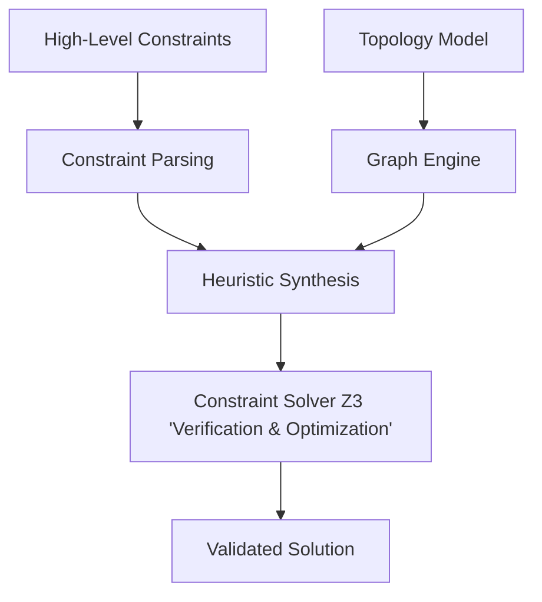

# Feature Set Definition v2

Diese Arbeit konkurrenziert nicht mit bestehenden Tools am Markt, sondern baut einen algorithmisches Forschungsprototypen.

## Table of Contents

- [Zweck dieses Dokuments](#zweck-dieses-dokuments)
- [2. Systemübersicht](#2-systemübersicht)
- [3. Kernfeatures](#3-kernfeatures)
  - [3.1 Definition von High-Level Constraints](#31-definition-von-high-level-constraints)
  - [3.2 Digital Twin Topologiemodell (vereinfacht)](#32-digital-twin-topologiemodell-vereinfacht)
  - [3.3 Graphbasierte Pfadanalyse](#33-graphbasierte-pfadanalyse)
  - [3.4 Constraint Evaluation Engine](#34-constraint-evaluation-engine)
  - [3.5 Heuristische Segmentierungs-Synthese (Initiallösung)](#35-heuristische-segmentierungs-synthese-initiallösung)
  - [3.6 Constraint Solver Integration (Z3)](#36-constraint-solver-integration-z3)

## Zweck dieses Dokuments

Dieses Dokument definiert das geplante Feature Set des Prototyps, der im Rahmen der Bachelorarbeit "Automatisierte Microsegmentierungsstrategie basierend auf Digital Twin Netzwerk‑Mapping" entwickelt wird.

Ziel des Systems ist es, Netzwerkkommunikation automatisch zu analysieren, das Netzwerk als graphbasierten Digital Twin zu modellieren und daraus minimale Microsegmentierungsregeln abzuleiten, welche eine Deny‑by‑Default Sicherheitsstrategie unterstützen.

Das definierte Feature Set berücksichtigt insbesondere:

- wissenschaftlichen Beitrag
- Umsetzbarkeit im Rahmen einer Bachelorarbeit
- klare modulare Architektur
- reproduzierbare Experimente

Das resultierende System ist als Forschungsprototyp gedacht und nicht als produktionsreifes Security‑Produkt.

## 2. Systemübersicht

Der Prototyp besteht aus einer neuen, klar strukturierten Synthese-Pipeline:



## 3. Kernfeatures

### 3.1 Definition von High-Level Constraints

Das System ermöglicht die Definition von abstrakten Netzwerkregeln und Topologieeinschränkungen.

#### Constraint-Typen

1. Kommunikationsregeln

```bash
ALLOW User1 -> User8
DENY  User1 -> User7
```

1. Topologie-Constraints

```bash
LOCATED_AT User1 Switch01
CONNECTED Switch01 Switch02
```

#### Ziel

- Abstraktion von Low-Level Netzwerkregeln
- Fokus auf Intent statt Implementation

#### Output

Eine strukturierte Constraint-Repräsentation zur weiteren Verarbeitung.

---

### 3.2 Digital Twin Topologiemodell

Im Gegensatz zu v1 wird kein Traffic modelliert, sondern eine explizite Netzwerktopologie.

### Graphmodell

Nodes:

- Hosts
- Switches

Edges:

- Physische Verbindungen

####  Beispiel

```bash
User1 -- Switch01 -- Switch02 -- User8
```

#### Ziel

- Grundlage für Pfadberechnung
- Abbildung realer Netzwerkinfrastruktur

---

### 3.3 Graphbasierte Pfadanalyse

Das System analysiert die Topologie zur Bestimmung von Kommunikationspfaden.

#### Funktionen

- Berechnung von Pfaden zwischen Hosts
- Identifikation aller beteiligten Netzwerkgeräte
- Reachability-Analyse

#### Beispiel

```bash
Path(User1, User8) =
[User1 → Switch01 → Switch02 → User8]
```

#### Zweck

- Grundlage für VLAN-Zuweisung
- Erkennung von Abhängigkeiten entlang des Pfads

---

### 3.4 Constraint Evaluation Engine

Diese Komponente überprüft, ob eine gegebene Lösung die definierten Constraints erfüllt.

#### Prüfkriterien

- Alle ALLOW-Constraints sind erreichbar
- Alle DENY-Constraints sind blockiert
- Topologie-Constraints sind eingehalten

#### Beispiel

```bash
ALLOW(User1, User8)  -> reachable == true
DENY(User1, User7)   -> reachable == false
```

#### Ziel

- Validierung der generierten Segmentierung
- Grundlage für iterative Verbesserung

---

### 3.5 Heuristische Segmentierungs-Synthese

Diese Komponente erzeugt eine erste gültige Segmentierung basierend auf einfachen heuristischen Verfahren.

####  Rolle im System

- Generiert eine initiale Lösung
- Dient als:
  - Debugging-Basis
  - Vergleichswert für Solver
  - Fallback bei Solver-Problemen

#### Eigenschaften

- greedy Ansatz
- deterministisch
- keine Garantie auf Optimalität

#### Grundidee

1. Für jede erlaubte Kommunikation:
    - Pfad bestimmen
    - gemeinsames VLAN entlang Pfad zuweisen
2. Für verbotene Kommunikation:
    - Trennung der Segmente sicherstellen

#### Output

gültige (aber nicht notwendigerweise optimale) Segmentierung

---

###  3.6 Constraint Solver Integration (Z3)

Diese Komponente modelliert das Segmentierungsproblem formal und löst es mittels eines SMT-Solvers.

#### Ziel

- formale Korrektheit garantieren
- optimale oder verbesserte Lösungen finden
- Konflikte erkennen (UNSAT)

#### Modellierung

#### Variablen

`VLAN(node)`

##### Constraints

ALLOW:

`VLAN(A) == VLAN(B)`

DENY:

`VLAN(A) != VLAN(B)``

#### Erweiterung (optional)

- Minimierung der VLAN-Anzahl
- Gewichtete Constraints

#### Rollen des Solvers

1. Verifikation
    - prüft heuristische Lösung

2. Optimierung

    - findet bessere Lösung

3. Fehlererkennung

    - erkennt unlösbare Constraint-Sets

#### Output

`SAT`

oder

`UNSAT`
`Reason: Conflicting constraints`

