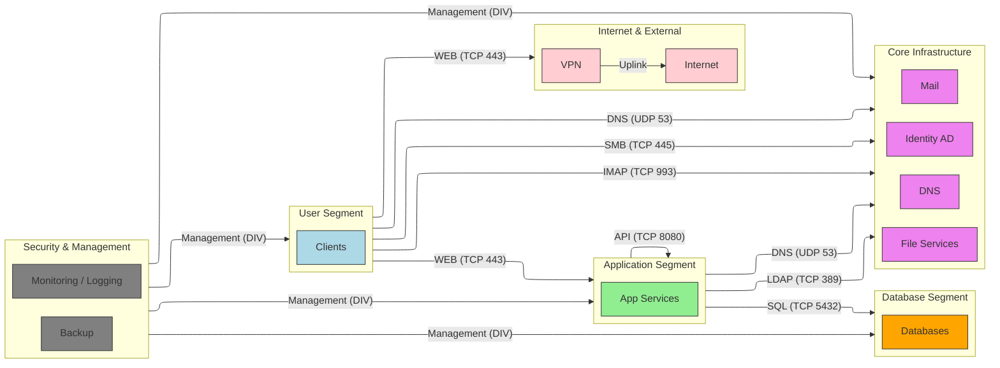

# Modell des Netzwerks

- Segmente (implizit, nicht vorgegeben!)
- User / Clients
- Application Services
- Core Infrastructure
- Security / Management
- Data Layer

##  Rollen

- Identity (AD)
- DNS
- Fileservices
- Mail
- Monitoring
- Backup
- Security

## Kommunikationsmuster

- Users → viele Services
- Apps → DB
- Infra → alle
- zentrale Dienste (DNS, AD)

##  Erwartete Segmente

- User Cluster
- App Cluster
- DB Cluster
- Infra evtl. separat oder verteilt

